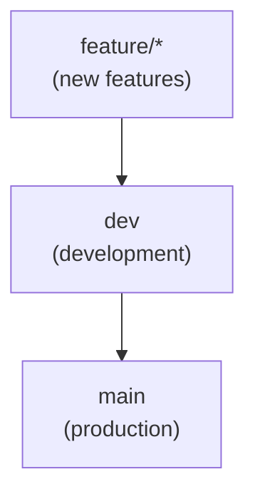

# Vite PowerFlow ⚡

<div style="display: flex; flex-wrap: wrap; gap: 4px;">
  
  
  
  
  
  
  
  
  
  
  

</div>
<br/>

A React + Vite starter, fully containerized for reproducible and collaborative development, with strict code quality tooling and AI pair programming workflow (Cursor rules). Includes comprehensive testing, linting, and CI/CD configurations following industry best practices.

## 📋 Table of Contents

- [Features](#-features)
- [Quick Start](#-quick-start)
- [AI-Powered Development](#-ai-powered-development)
- [Development Setup](#-development-setup)
- [Testing](#-testing)
- [Project Configuration](#-project-configuration)
- [Available Scripts](#-available-scripts)
- [Contribution Guidelines](#-contribution-guidelines)
- [License](#-license)

<hr>

## ✨ Features

### 🛠️ Core Stack

- **[React](https://reactjs.org/)** - UI library for building interactive web apps
- **[Vite](https://vitejs.dev/)** - Lightning-fast build tool with instant HMR and optimized production builds
- **[TypeScript](https://www.typescriptlang.org/)** - Type-safe JavaScript for better code quality

### 🎨 UI & Styling

- **[Tailwind CSS](https://tailwindcss.com/)** - Utility-first CSS framework for rapid UI development
- **[shadcn/ui](https://ui.shadcn.com/)** - Re-usable components built with Radix UI and Tailwind CSS
- **[Storybook](https://storybook.js.org/)** - Component playground for isolated development and testing

### 📦 State & Data Management

- **[Zustand](https://github.com/pmndrs/zustand)** - Lightweight state management library
- **[TanStack Query](https://tanstack.com/query/latest)** - Powerful data fetching and caching solution

### 🧪 Testing & Code Quality

- **[Vitest](https://vitest.dev/)** - Fast unit and integration testing framework
- **[Playwright](https://playwright.dev/)** - Modern end-to-end testing tool
- **[ESLint](https://eslint.org/)** + **[Prettier](https://prettier.io/)** - Code quality and formatting tools

### 🔄 Development Workflow

- **[Husky](https://typicode.github.io/husky/)** - Git hooks for automated validations
- **[lint-staged](https://github.com/okonet/lint-staged)** - Staged files linting for code consistency
- **[commitlint](https://commitlint.js.org/)** - Standardized commits for clear commit history
- **[GitHub Actions](https://github.com/features/actions)** - Automated CI/CD for seamless integration and deployment

<hr>

## 🚀 Quick Start

### Prerequisites

- [Node.js](https://nodejs.org/) (v18 or higher)
- [Cursor AI Editor](https://www.cursor.com) or [Visual Studio Code](https://code.visualstudio.com/)
- [Docker](https://www.docker.com/)

> **Note:** For the best AI-assisted development experience, use [Cursor AI Editor](https://www.cursor.com).
> If you prefer a classic setup, [Visual Studio Code](https://code.visualstudio.com/) works perfectly.

### Generate an app using the CLI tool

1. Run this command in your terminal

   ```bash
   npx create-vite-powerflow my-app
   ```

2. Open the folder in your code editor

3. `Reopen in Container` when prompted (Dev Container)

   

4. Wait for the installation (It can take a few minutes)

5. Launch dev server:

   ```bash
   pnpm dev
   ```

6. Start developing! 🚀

<hr>

## 🤖 AI-Powered Development

The **Vite PowerFlow** starter is optimized for **Cursor AI Code Editor** with pre-configured rules that enhance AI code assistance and code generation. These rules are defined in the [.cursor/rules/](./.cursor/rules/) directory and help the AI understand your project's context and best practices.

**Note**: While the project works perfectly with any IDE, Cursor's AI features are limited to 50 requests in the free tier. A paid subscription is required to access the enhanced development experience.

> For detailed GitHub CLI and AI integration setup, see [GitHub CLI AI Setup](docs/github-cli-ai-setup.md)

### Available Rules

The following rules are pre-configured to enhance your development experience:

| Rule File                                                                                  | Description                                                              |
| ------------------------------------------------------------------------------------------ | ------------------------------------------------------------------------ |
| [code-standards.mdc](./.cursor/rules/code-standards.mdc)                                   | Coding standards for the project (TypeScript, React, naming conventions) |
| [development-methodology.mdc](./.cursor/rules/development-methodology.mdc)                 | Methodologies to follow (TDD, atomic commits, SoC)                       |
| [documentation-versioning.mdc](./.cursor/rules/documentation-versioning.mdc)               | How to manage documentation and versioning                               |
| [ecosystem-convention.mdc](./.cursor/rules/ecosystem-convention.mdc)                       | How to align with ecosystem and tool-specific conventions                |
| [expected-AI-behavior.mdc](./.cursor/rules/expected-AI-behavior.mdc)                       | How the AI should interact, suggest, and validate code                   |
| [github-cli-integration.mdc](./.cursor/rules/github-cli-integration.mdc)                   | How to use GitHub CLI efficiently in the workflow                        |
| [github-pr-conventions.mdc](./.cursor/rules/github-pr-conventions.mdc)                     | Pull request standards and templates                                     |
| [interaction-protocol.mdc](./.cursor/rules/interaction-protocol.mdc)                       | How the AI should communicate and interact with the user                 |
| [language-policy.mdc](./.cursor/rules/language-policy.mdc)                                 | Language and naming conventions for code and documentation               |
| [project-architecture-principles.mdc](./.cursor/rules/project-architecture-principles.mdc) | Architectural guidelines for the project                                 |
| [technical-AI-posture.mdc](./.cursor/rules/technical-AI-posture.mdc)                       | The expected technical rigor and posture of the AI assistant             |

> **Note**: You can customize these rules by adding, removing, or modifying them in the '.cursor/rules/' directory to better match your project's requirements and development workflow.

<hr>

## 💻 Development Setup

This project uses VS Code Dev Containers to provide a consistent development environment with all necessary tools and configurations, ensuring high-quality development practices across the team.

### Code Quality

- **Prettier** ([.prettierrc](./.prettierrc)) — Automatic code formatting for a consistent style
- **ESLint** ([eslint.config.js](./eslint.config.js)) — Enforces code quality and best practices for TypeScript/React
- **EditorConfig** ([.editorconfig](./.editorconfig)) — Consistent indentation and line endings across editors
- **CommitLint** ([commitlint.config.js](./commitlint.config.js)) — Enforces conventional commit messages
- **lint-staged** ([.lintstagedrc.js](./.lintstagedrc.js)) — Runs linters and formatters only on staged files for fast feedback
- **Husky** ([.husky/](./.husky/)) — Automates all code quality checks with Git hooks (pre-commit, pre-push, etc.)

### Development Environment

The VS Code Dev Container setup provides a complete development environment:

- **VS Code Dev Container**
  - **Configuration** ([.devcontainer/devcontainer.json](./.devcontainer/devcontainer.json)) — Main container configuration with editor extensions and workspace settings
  - **Editor Settings** ([.vscode/settings.json](./.vscode/settings.json)) — Cross-editor settings for consistent development experience
  - **Lifecycle Scripts** ([.devcontainer/scripts/](./.devcontainer/scripts/))
    - [on-create.sh](./.devcontainer/scripts/on-create.sh) — Initial environment setup when container is created
    - [post-create.sh](./.devcontainer/scripts/post-create.sh) — User-specific configurations after container creation
    - [update-content.sh](./.devcontainer/scripts/update-content.sh) — Dependency updates when container is rebuilt

- **Docker Configuration**
  - **Container Image** ([Dockerfile](./Dockerfile)) — Base image with Playwright browser dependencies
  - **Services** ([docker-compose.yml](./docker-compose.yml)) — Container orchestration with persistent browser cache
  - **Architecture**
    - Dev Container for VS Code integration and development tools
    - Docker Compose for service orchestration and volume management
    - Persistent volume for Playwright browser cache to speed up E2E tests
    - System dependencies pre-installed for browser automation

### UI Development

Our UI development stack combines modern tools for efficient component development and styling:

- **Tailwind CSS** ([tailwind.config.js](./tailwind.config.js)) — Utility-first CSS framework for rapid UI development
- **shadcn/ui** ([components.json](./components.json)) — Re-usable components built with Radix UI and Tailwind CSS
- **Storybook** ([.storybook/](./.storybook/)) — Isolated component development and testing environment

This combination enables:

- Rapid UI development with utility classes
- Consistent, accessible components through shadcn/ui
- Isolated component testing and documentation in Storybook
- Visual regression testing and component playground

### CI/CD Workflows

This project implements a robust two-layered CI/CD workflow that ensures code quality and consistency at every stage of development:

#### Local Quality Checks (Git Hooks)

Automated checks run locally before every commit and push to prevent errors from reaching the repository.

- **Pre-commit** ([.husky/pre-commit](./.husky/pre-commit)) — Lint, unit/integration tests (`pnpm validate:precommit`)
- **Pre-push** ([.husky/pre-push](./.husky/pre-push)) — Full validation: lint, format, type-check, all tests (`pnpm validate:full`)

#### Remote Pipelines (GitHub Actions)

The CI workflow ([.github/workflows/execute-ci-pipeline.yml](./.github/workflows/execute-ci-pipeline.yml)) ensures code quality through automated validation on critical branches:

- **On push to `main` or `dev`**:
  - Linting (ESLint)
  - Formatting (Prettier)
  - Type-checking (TypeScript)
  - Build

- **On pull request (any target branch)**:
  - Linting (ESLint)
  - Formatting (Prettier)
  - Type-checking (TypeScript)
  - Commit message validation (Commitlint)
  - Build

> **Note:** Commitlint runs only on pull requests, not on direct pushes or on merge/squash commits generated by GitHub.

#### Branch Protection

Branch protection rules are managed as code using [Probot Settings](https://github.com/apps/settings).
To enable automatic enforcement, install the app on your repository or organization.
Any change to `.github/settings.yml` on the default branch will be automatically applied.

- **Protected branches:** `main` and `dev`
- **Required status checks:** Commitlint, ESLint, Prettier, build, TypeScript
- **Pull request review:** At least 1 approval, dismiss stale reviews
- **Enforce admins:** Yes
- **Force pushes:** Not allowed
- **Branch deletions:** Not allowed
- **Linear history:** Not required (merge commits allowed)
- **Conversation resolution:** Required before merging

#### Dependency Management

Dependencies are automatically managed through Dependabot:

- **Update Schedule**
  - Weekly updates for npm packages
  - Weekly updates for GitHub Actions
  - Security updates are processed immediately

- **Update Strategy**
  - Grouped updates by dependency type (dev/prod)
  - Auto-merge for compatible updates
  - Automatic PR approval for security patches
  - All updates target the `dev` branch for review

- **Configuration**
  - [.github/dependabot.yml](./.github/dependabot.yml) — Dependabot configuration
  - [.github/workflows/dependabot-auto.yml](./.github/workflows/dependabot-auto.yml) — Auto-merge workflow

<hr>

## 🧪 Testing

Our testing strategy ensures code quality and reliability through a comprehensive suite of automated tests. We employ a multi-layered approach combining unit, integration, and end-to-end testing to catch issues early and maintain high standards.

### Test Types

#### Unit & Integration Tests

- **Framework**: Vitest + Testing Library
- **Location**: `tests/unit/` and `tests/integration/`
- **Coverage**: Components, utilities, and business logic
- **Configuration**: [vitest.config.ts](./vitest.config.ts)
- **Script**: `scripts/runUnitIntegrationTests.sh`

#### End-to-End Tests

- **Framework**: Playwright
- **Location**: `tests/e2e/`
- **Coverage**: User flows and cross-browser compatibility
- **Configuration**: [playwright.config.ts](./playwright.config.ts)
- **Browsers**: Chromium (default), Firefox, WebKit
- **Script**: `scripts/runEndToEndTests.sh`

### Test Scripts

The custom scripts for test execution are automatically integrated into the main validation workflow:

- `scripts/runUnitIntegrationTests.sh` (unit & integration tests)
  - Detects the presence of unit and integration test files
  - Runs Vitest only if relevant test files are present
  - Prints a non-blocking warning if no tests are detected

- `scripts/runEndToEndTests.sh` (end-to-end tests)
  - Detects the presence of E2E test files
  - Installs all Playwright browsers and dependencies only if needed
  - Uses a persistent browser cache for faster test runs
  - Prints a non-blocking warning if no E2E tests are detected

These scripts are invoked by the following validation commands:

- `pnpm validate:precommit`
- `pnpm validate:full`
- `pnpm validate:quick`

You do not need to run these scripts directly during normal development. They are integrated into the pre-commit, pre-push, and CI workflows to ensure that tests are always checked when relevant.

<hr>

## 🔧 Project Configuration

This section details the essential configuration aspects of the project, including project structure and architectural decisions. Understanding these configurations is crucial for development and maintenance.

> For environment variables configuration, see [Vite's official documentation](https://vitejs.dev/guide/env-and-mode.html).

### Architecture

```
├── src/
│   ├── components/    # Reusable UI components
│   ├── hooks/         # Custom React hooks
│   ├── lib/           # Utility functions and configurations
│   ├── pages/         # Page components
│   ├── styles/        # Global styles and Tailwind config
│   └── types/         # TypeScript type definitions
├── tests/
│   ├── unit/          # Unit tests
│   ├── integration/   # Integration tests
│   └── e2e/           # End-to-end tests
└── public/            # Static assets
```

### Path Aliases

To simplify imports and avoid long relative paths, this project uses **TypeScript path aliases** (e.g. `@/components`, `@/lib`).
These aliases are configured in:

- [`tsconfig.json`](./tsconfig.json) — for TypeScript
- [`vite.config.ts`](./vite.config.ts) — for Vite (development/build)
- [`vitest.config.ts`](./vitest.config.ts) — for Vitest (unit/integration tests)
  Ensure that these three files remain synchronized to maintain consistency.

**Example usage:**

```ts
import { Button } from '@/components/ui/button';
import { logger } from '@/lib/utils';
```

**Configuration example:**

- In `tsconfig.json`:
  ```json
  {
    "compilerOptions": {
      // ...other config
      "paths": {
        "@/*": ["src/*"],
        "@/components/*": ["src/components/*"]
        // ...other aliases
      }
    }
  }
  ```
- In `vite.config.ts`:

  ```ts
  export default defineConfig({
    // ...other config
    resolve: {
      alias: [
        { find: '@', replacement: resolve(__dirname, 'src') },
        { find: '@/components', replacement: resolve(__dirname, 'src/components') },
        // ...other aliases
      ],
    },
  });
  ```

- In `vitest.config.ts`:

  ```ts
  export default defineConfig({
    // ...other config
    resolve: {
      alias: [
        { find: '@', replacement: resolve(__dirname, 'src') },
        { find: '@/components', replacement: resolve(__dirname, 'src/components') },
        // ...other aliases
      ],
    },
  });
  ```

### TypeScript Configuration

TypeScript configuration is split across multiple files to maintain a clean separation of concerns and optimize the development experience. Each configuration file serves a specific purpose in the build and development pipeline.

- [tsconfig.json](./tsconfig.json) — Base TypeScript config
- [tsconfig.app.json](./tsconfig.app.json) — App-specific overrides
- [tsconfig.node.json](./tsconfig.node.json) — Node-specific overrides
- [tsconfig.storybook.json](./tsconfig.storybook.json) — Storybook-specific overrides
- [tsconfig.eslint.json](./tsconfig.eslint.json) — ESLint-specific overrides

<hr>

## 🚀 Available Scripts

This project includes a comprehensive set of scripts to streamline development, testing, and quality assurance workflows. These scripts are designed to maintain code quality and ensure consistent development practices.

### Development

- `pnpm dev` — Start development server
- `pnpm build` — Build for production
- `pnpm preview` — Preview production build
- `pnpm lint` — Run ESLint
- `pnpm format` — Run Prettier
- `pnpm type-check` — Run TypeScript compiler

### Testing

- `pnpm test` — Run unit and integration tests
- `pnpm test:unit` — Run unit tests
- `pnpm test:integration` — Run integration tests
- `pnpm test:e2e` — Run E2E tests
- `pnpm test:coverage` — Generate test coverage report

### Quality Assurance

- `pnpm validate:precommit` — Fast validation (lint, format, type-check and unit tests)
- `pnpm validate:full` — Full validation (lint, format, type-check and unit tests, integration tests, E2E tests)
- `pnpm storybook` — Start Storybook local server

See [package.json](./package.json) for the complete list of available scripts.

<hr>

## 🤝 Contribution Guidelines

These guidelines are designed to help your team collaborate effectively on any project built with this starter template. They provide a standardized approach to development that ensures code quality and maintainability across your team.

### Commit Conventions

We recommend using [commitlint](https://commitlint.js.org/) to enforce [Conventional Commits](https://www.conventionalcommits.org/) for all commit messages. This helps maintain a clear and consistent commit history.

**Simple format:**

```
type(scope): short description

detailed description (optional)

footer (optional)
```

**Commit types:**

- ✨ `feat`: New feature
- 🐛 `fix`: Bug fix
- 📚 `docs`: Documentation
- 💅 `style`: Formatting, missing semicolons, etc.
- ♻️ `refactor`: Code refactoring
- ⚡️ `perf`: Performance improvements
- ✅ `test`: Tests
- 🔧 `chore`: Maintenance

**Example commits:**

```bash
# Adding a feature
feat(auth): add Google authentication

# Fixing a bug
fix(api): fix 404 error handling

# Documentation
docs(readme): update installation instructions
```

### Git Workflow

We recommend this branching strategy for maintaining code quality and enabling smooth collaboration. It integrates with our branch protection rules and GitHub Actions, providing automated validation at each step. This workflow is pre-configured in the starter template.



- `main`: Production-ready code
- `dev`: Main development branch
- `feature/*`: Feature branches for new development

### Pull Requests

We provide two approaches for creating Pull Requests, both based on our PR template (`.github/pull_request_template.md`):

#### 1. Using Cursor IDE

If you're using Cursor IDE, the AI will automatically:

- Analyze your code changes
- Generate a comprehensive PR description based on the template
- Suggest appropriate change types and quality checks
- Help review the changes for consistency and standards

The AI uses the PR template structure while intelligently filling it based on your actual code modifications.

#### 2. Using PR Template Directly

For those not using Cursor, you can directly use the PR template located at `.github/pull_request_template.md`. This template provides a structured format for:

- Describing changes
- Listing implemented features
- Tracking completed tasks
- Specifying change types
- Ensuring quality assurance
- Adding additional notes
- Handling Dependabot updates

Both approaches ensure consistent PR documentation by following the same template structure. Cursor IDE simply makes the process more efficient by automatically generating the content based on your changes.

<hr>

## 📝 License

This project is licensed under the MIT License - see the [LICENSE](LICENSE) file for details.

<hr>

## 👤 Credits

This starter template was created and is maintained by [Shynn](https://github.com/shynnobi)

[](https://github.com/shynnobi)
