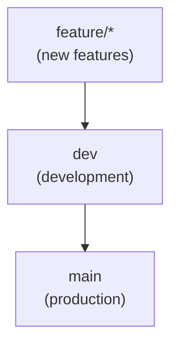

# Vite PowerFlow ⚡

  [](https://github.com/shynnobi/vite-powerflow/actions)

A React + Vite starter, fully containerized for reproducible and collaborative development, with strict code quality tooling. Includes comprehensive testing, linting, and CI/CD configurations following industry best practices.

## 📋 Table of Contents

- [Features](#-features)
- [Quick Start](#-quick-start)
- [AI-Powered Development](#-ai-powered-development)
- [Development Setup](#-development-setup)
- [Testing](#-testing)
- [Project Configuration](#-project-configuration)
- [Available Scripts](#-available-scripts)
- [Contribution Guidelines](#-contribution-guidelines)
- [License](#-license)

## ✨ Features

### 🛠️ Core Stack

- **[React](https://reactjs.org/)** - UI library for building interactive web apps
- **[Vite](https://vitejs.dev/)** - Lightning-fast build tool with instant HMR and optimized production builds
- **[TypeScript](https://www.typescriptlang.org/)** - Type-safe JavaScript for better code quality

### 🎨 UI & Styling

- **[Tailwind CSS](https://tailwindcss.com/)** - Utility-first CSS framework for rapid UI development
- **[shadcn/ui](https://ui.shadcn.com/)** - Re-usable components built with Radix UI and Tailwind CSS
- **[Storybook](https://storybook.js.org/)** - Component playground for isolated development and testing

### 🌐 SEO & PWA

- **[React Helmet Async](https://github.com/staylor/react-helmet-async)** - Meta tags, Open Graph, and Twitter Cards
- **[vite-plugin-pwa](https://github.com/vite-pwa/vite-plugin-pwa)** - Installable web app with service worker
- **[vite-plugin-sitemap](https://github.com/nuxt-contrib/vite-plugin-sitemap)** - Automatic XML sitemap generation
- **SEO Components** - Configurable SEO component for all pages

### 📦 State & Data Management

- **[Zustand](https://github.com/pmndrs/zustand)** - Lightweight state management library
- **[TanStack Query](https://tanstack.com/query/latest)** - Powerful data fetching and caching solution

### 🧪 Testing & Code Quality

- **[Vitest](https://vitest.dev/)** - Fast unit and integration testing framework
- **[Playwright](https://playwright.dev/)** - Modern end-to-end testing tool
- **[ESLint](https://eslint.org/)** + **[Prettier](https://prettier.io/)** - Code quality and formatting tools

### 🔄 Development Workflow

- **[Husky](https://typicode.github.io/husky/)** - Git hooks for automated validations
- **[lint-staged](https://github.com/okonet/lint-staged)** - Staged files linting for code consistency
- **[commitlint](https://commitlint.js.org/)** - Standardized commits for clear commit history
- **[GitHub Actions](https://github.com/features/actions)** - Automated CI/CD for seamless integration and deployment

## 🚀 Quick Start

### Prerequisites

- [Node.js](https://nodejs.org/) (v18 or higher)
- [Visual Studio Code](https://code.visualstudio.com/) or any modern IDE with AI support
- [Docker](https://www.docker.com/)

### Generate an app using the CLI tool

1. Run this command in your terminal:

   ```bash
   npx @vite-powerflow/create my-app
   ```

   > You can also run the CLI tool in non-interactive mode for faster setup.

2. Open the folder in your code editor

3. `Reopen in Container` when prompted (Dev Container)

   

4. Wait for the installation (It can take a few minutes)

5. Launch dev server:

   ```bash
   pnpm dev
   ```

6. Start developing! 🚀

<hr>

### CLI Options

The CLI tool supports the following options for non-interactive usage:

| Flag/Argument                  | Description                                  |
| ------------------------------ | -------------------------------------------- |
| `[project-directory]`          | The name of the project directory (required) |
| `-g, --git`                    | Initialize Git repository                    |
| `-u, --git-user-name <name>`   | Git user.name (required with --git)          |
| `-e, --git-user-email <email>` | Git user.email (required with --git)         |
| `-o, --use-global-git`         | Use global Git identity if found             |

## 🤖 AI-Powered Development

Vite PowerFlow uses `AGENTS.md` as the single source of truth for AI agent behavior,
coding standards, workflow guidance, and quality expectations.

This open format is readable by major AI coding tools and IDE agents (Codex, Jules,
Cursor, Windsurf, Copilot, Devin, Aider, and others), which avoids duplicating rules per
editor.

- Monorepo rules: [`AGENTS.md`](./AGENTS.md)
- Starter essential rules: [`apps/starter/AGENTS.md`](./apps/starter/AGENTS.md)

> For detailed GitHub CLI and AI integration setup, see [GitHub CLI AI Setup](docs/github-cli-ai-setup.md)

## 💻 Development Setup

This project uses VS Code Dev Containers to provide a consistent development environment with all necessary tools and configurations, ensuring high-quality development practices across the team.

### Code Quality

- **Prettier** ([.prettierrc](./.prettierrc)) — Automatic code formatting for a consistent style
- **ESLint** ([eslint.config.js](./eslint.config.js)) — Enforces code quality and best practices for TypeScript/React
- **EditorConfig** ([.editorconfig](./.editorconfig)) — Consistent indentation and line endings across editors
- **CommitLint** ([commitlint.config.js](./commitlint.config.js)) — Enforces conventional commit messages
- **lint-staged** ([.lintstagedrc.js](./.lintstagedrc.js)) — Runs linters and formatters only on staged files for fast feedback
- **Husky** ([.husky/](./.husky/)) — Automates all code quality checks with Git hooks (pre-commit, pre-push, etc.)

### Development Environment

The VS Code Dev Container setup provides a complete development environment:

- **VS Code Dev Container**
  - **Configuration** ([.devcontainer/devcontainer.json](./.devcontainer/devcontainer.json)) — Main container configuration with editor extensions and workspace settings
  - **Editor Settings** ([.vscode/settings.json](./.vscode/settings.json)) — Cross-editor settings for consistent development experience
  - **Lifecycle Scripts** ([.devcontainer/scripts/](./.devcontainer/scripts/))
    - [on-create.sh](./.devcontainer/scripts/on-create.sh) — Initial environment setup when container is created
    - [post-create.sh](./.devcontainer/scripts/post-create.sh) — User-specific configurations after container creation
    - [update-content.sh](./.devcontainer/scripts/update-content.sh) — Dependency updates when container is rebuilt

- **Docker Configuration**
  - **Container Image** ([Dockerfile](./Dockerfile)) — Base image with Playwright browser dependencies
  - **Services** ([docker-compose.yml](./docker-compose.yml)) — Container orchestration with persistent browser cache
  - **Architecture**
    - Dev Container for VS Code integration and development tools
    - Docker Compose for service orchestration and volume management
    - Persistent volume for Playwright browser cache to speed up E2E tests
    - System dependencies pre-installed for browser automation

### UI Development

Our UI development stack combines modern tools for efficient component development and styling:

- **Tailwind CSS** ([tailwind.config.js](./tailwind.config.js)) — Utility-first CSS framework for rapid UI development
- **shadcn/ui** ([components.json](./components.json)) — Re-usable components built with Radix UI and Tailwind CSS
- **Storybook** ([.storybook/](./.storybook/)) — Isolated component development and testing environment

This combination enables:

- Rapid UI development with utility classes
- Consistent, accessible components through shadcn/ui
- Isolated component testing and documentation in Storybook
- Visual regression testing and component playground

### CI/CD Workflows

This project implements a robust two-layered CI/CD workflow that ensures code quality and consistency at every stage of development:

#### Local Quality Checks (Git Hooks)

Automated checks run locally before every commit and push to prevent errors from reaching the repository.

- **Pre-commit** ([.husky/pre-commit](./.husky/pre-commit)) — Lint, unit/integration tests (`pnpm validate:commit`)
- **Pre-push** ([.husky/pre-push](./.husky/pre-push)) — Full validation: lint, format, type-check, all tests (`pnpm validate:full`)

#### Remote Pipelines (GitHub Actions)

The CI workflow ([.github/workflows/execute-ci-pipeline.yml](./.github/workflows/execute-ci-pipeline.yml)) ensures code quality through automated validation on critical branches:

- **On push to `main` or `dev`**:
  - Linting (ESLint)
  - Formatting (Prettier)
  - Type-checking (TypeScript)
  - Build

- **On pull request (any target branch)**:
  - Linting (ESLint)
  - Formatting (Prettier)
  - Type-checking (TypeScript)
  - Commit message validation (Commitlint)
  - Build

> **Note:** Commitlint runs only on pull requests, not on direct pushes or on merge/squash commits generated by GitHub.

#### Branch Protection

Branch protection rules are managed as code using [Probot Settings](https://github.com/apps/settings).
To enable automatic enforcement, install the app on your repository or organization.
Any change to `.github/settings.yml` on the default branch will be automatically applied.

- **Protected branches:** `main` and `dev`
- **Required status checks:** Commitlint, ESLint, Prettier, build, TypeScript
- **Pull request review:** At least 1 approval, dismiss stale reviews
- **Enforce admins:** Yes
- **Force pushes:** Not allowed
- **Branch deletions:** Not allowed
- **Linear history:** Not required (merge commits allowed)
- **Conversation resolution:** Required before merging

#### Dependency Management

Dependencies are automatically managed through Dependabot:

- **Update Schedule**
  - Weekly updates for npm packages
  - Weekly updates for GitHub Actions
  - Security updates are processed immediately

- **Update Strategy**
  - Grouped updates by dependency type (dev/prod)
  - Auto-merge for compatible updates
  - Automatic PR approval for security patches
  - All updates target the `dev` branch for review

- **Configuration**
  - [.github/dependabot.yml](./.github/dependabot.yml) — Dependabot configuration
  - [.github/workflows/dependabot-auto.yml](./.github/workflows/dependabot-auto.yml) — Auto-merge workflow

## 🧪 Testing

Our testing strategy ensures code quality and reliability through a comprehensive suite of automated tests. We employ a multi-layered approach combining unit, integration, and end-to-end testing to catch issues early and maintain high standards.

### Test Types

#### Unit & Integration Tests

- **Framework**: Vitest + Testing Library
- **Location**: `tests/unit/` and `tests/integration/`
- **Coverage**: Components, utilities, and business logic
- **Configuration**: [vitest.config.ts](./vitest.config.ts)

#### End-to-End Tests

- **Framework**: Playwright
- **Location**: `tests/e2e/`
- **Coverage**: User flows and cross-browser compatibility
- **Configuration**: [playwright.config.ts](./playwright.config.ts)
- **Browsers**: Chromium (default), Firefox, WebKit
- **Script**: `scripts/run-end-to-end-tests.sh`

### Test Scripts

The custom scripts for test execution are automatically integrated into the main validation workflow:

- `scripts/run-end-to-end-tests.sh` (end-to-end tests)
  - Detects the presence of E2E test files
  - Installs all Playwright browsers and dependencies only if needed
  - Uses a persistent browser cache for faster test runs
  - Prints a non-blocking warning if no E2E tests are detected

These scripts are invoked by the following validation commands:

- `pnpm validate:commit`
- `pnpm validate:full`
- `pnpm validate:quick`

You do not need to run these scripts directly during normal development. They are integrated into the pre-commit, pre-push, and CI workflows to ensure that tests are always checked when relevant.

## 🔧 Project Configuration

This section details the essential configuration aspects of the project, including project structure and architectural decisions. Understanding these configurations is crucial for development and maintenance.

> For environment variables configuration, see [Vite's official documentation](https://vitejs.dev/guide/env-and-mode.html).

### Architecture

```
├── src/
│   ├── components/    # Reusable UI components
│   ├── hooks/         # Custom React hooks
│   ├── lib/           # Utility functions and configurations
│   ├── pages/         # Page components
│   ├── styles/        # Global styles and Tailwind config
│   └── types/         # TypeScript type definitions
├── tests/
│   ├── unit/          # Unit tests
│   ├── integration/   # Integration tests
│   └── e2e/           # End-to-end tests
└── public/            # Static assets
```

### SEO & PWA Configuration

The project includes comprehensive SEO and PWA configuration for production-ready applications:

#### SEO Components

- **SEO Component** (`src/components/SEO.tsx`) - Configurable component for meta tags, Open Graph, and Twitter Cards
- **React Helmet Async** - Document head management for dynamic meta tag updates
- **Open Graph & Twitter Cards** - Social media sharing with customizable images and descriptions
- **Dynamic Sitemap** - Automatic XML sitemap generation for search engines
- **Robots.txt Generation** - Automated robots.txt with basic security rules and sitemap reference
- **Canonical URLs** - Proper URL canonicalization for SEO

#### PWA Infrastructure

- **Web App Manifest** - PWA manifest with configurable app metadata and icons
- **Service Worker** - Automatic service worker generation via VitePWA plugin
- **App Installation** - Installable web app with standalone display mode
- **Theme Customization** - Configurable theme and background colors
- **Favicon Management** - Multi-format favicon support for different devices

#### Build Optimizations

- **Image Optimization** - Automatic PNG/JPEG/WebP compression with vite-plugin-image-optimizer
- **Asset Compression** - Gzip compression for optimized bundle sizes
- **HTML Minification** - Production-ready HTML optimization

#### Configuration Files

- [`vite.config.ts`](./vite.config.ts) — PWA, sitemap, compression, and image optimization plugins
- [`src/components/SEO.tsx`](./src/components/SEO.tsx) — SEO component for meta tags management
- [`src/config/projectConfig.ts`](./src/config/projectConfig.ts) — Centralized SEO and PWA configuration
- [`public/images/og-image-1200-630.png`](./public/images/og-image-1200-630.png) — Default Open Graph image

### Path Aliases

To simplify imports and avoid long relative paths, this project uses **TypeScript path aliases** (e.g. `@/components`, `@/lib`).
These aliases are configured in:

- [`tsconfig.json`](./tsconfig.json) — for TypeScript
- [`vite.config.ts`](./vite.config.ts) — for Vite (development/build)
- [`vitest.config.ts`](./vitest.config.ts) — for Vitest (unit/integration tests)
  Ensure that these three files remain synchronized to maintain consistency.

**Example usage:**

```ts
import { Button } from '@/components/ui/button';
import { logger } from '@/lib/utils';
```

**Configuration example:**

- In `tsconfig.json`:
  ```json
  {
    "compilerOptions": {
      // ...other config
      "paths": {
        "@/*": ["src/*"],
        "@/components/*": ["src/components/*"]
        // ...other aliases
      }
    }
  }
  ```
- In `vite.config.ts`:

  ```ts
  export default defineConfig({
    // ...other config
    resolve: {
      alias: [
        { find: '@', replacement: resolve(__dirname, 'src') },
        { find: '@/components', replacement: resolve(__dirname, 'src/components') },
        // ...other aliases
      ],
    },
  });
  ```

- In `vitest.config.ts`:

  ```ts
  export default defineConfig({
    // ...other config
    resolve: {
      alias: [
        { find: '@', replacement: resolve(__dirname, 'src') },
        { find: '@/components', replacement: resolve(__dirname, 'src/components') },
        // ...other aliases
      ],
    },
  });
  ```

### TypeScript Configuration

TypeScript configuration is split across multiple files to maintain a clean separation of concerns and optimize the development experience. Each configuration file serves a specific purpose in the build and development pipeline.

- [tsconfig.json](./tsconfig.json) — Base TypeScript config
- [tsconfig.app.json](./tsconfig.app.json) — App-specific overrides
- [tsconfig.node.json](./tsconfig.node.json) — Node-specific overrides
- [tsconfig.storybook.json](./tsconfig.storybook.json) — Storybook-specific overrides
- [tsconfig.eslint.json](./tsconfig.eslint.json) — ESLint-specific overrides

## 🚀 Available Scripts

This project includes a comprehensive set of scripts to streamline development, testing, and quality assurance workflows. These scripts are designed to maintain code quality and ensure consistent development practices.

### Development

- `pnpm dev` — Start development server
- `pnpm build` — Build for production
- `pnpm preview` — Preview production build
- `pnpm lint` — Run ESLint
- `pnpm format` — Run Prettier
- `pnpm type-check` — Run TypeScript compiler

### Testing

- `pnpm test` — Run unit and integration tests
- `pnpm test:unit` — Run unit tests
- `pnpm test:integration` — Run integration tests
- `pnpm test:e2e` — Run E2E tests
- `pnpm test:coverage` — Generate test coverage report

### Quality Assurance

- `pnpm validate:commit` — Fast validation (lint, format, type-check and unit tests)
- `pnpm validate:full` — Full validation (lint, format, type-check and unit tests, integration tests, E2E tests)
- `pnpm storybook` — Start Storybook local server

See [package.json](./package.json) for the complete list of available scripts.

## 🤝 Contribution Guidelines

These guidelines are designed to help your team collaborate effectively on any project built with this starter template. They provide a standardized approach to development that ensures code quality and maintainability across your team.

### Commit Conventions

We recommend using [commitlint](https://commitlint.js.org/) to enforce [Conventional Commits](https://www.conventionalcommits.org/) for all commit messages. This helps maintain a clear and consistent commit history.

**Simple format:**

```
type(scope): short description

detailed description (optional)

footer (optional)
```

**Commit types:**

- ✨ `feat`: New feature
- 🐛 `fix`: Bug fix
- 📚 `docs`: Documentation
- 💅 `style`: Formatting, missing semicolons, etc.
- ♻️ `refactor`: Code refactoring
- ⚡️ `perf`: Performance improvements
- ✅ `test`: Tests
- 🔧 `chore`: Maintenance

**Example commits:**

```bash
# Adding a feature
feat(auth): add Google authentication

# Fixing a bug
fix(api): fix 404 error handling

# Documentation
docs(readme): update installation instructions
```

### Git Workflow

We recommend this branching strategy for maintaining code quality and enabling smooth collaboration. It integrates with our branch protection rules and GitHub Actions, providing automated validation at each step. This workflow is pre-configured in the starter template.


```mermaid
graph TD
    feature["feature/*<br>(new features)"] --> dev["dev<br>(development)"]
    dev --> main["main<br>(production)"]
```

- `main`: Production-ready code
- `dev`: Main development branch
- `feature/*`: Feature branches for new development

### Pull Requests

Use the PR template located at `.github/pull_request_template.md`. This template provides a structured format for:

- Describing changes
- Listing implemented features
- Tracking completed tasks
- Specifying change types
- Ensuring quality assurance
- Adding additional notes
- Handling Dependabot updates

For the detailed PR workflow (`feat/fix -> dev` and sync `dev -> main`), follow the
process documented in [`AGENTS.md`](./AGENTS.md).

## 📝 License

This project is licensed under the MIT License - see the [LICENSE](LICENSE) file for details.

## 👤 Credits

This starter template was created and is maintained by [Shynn](https://github.com/shynnobi)

[](https://github.com/shynnobi)
