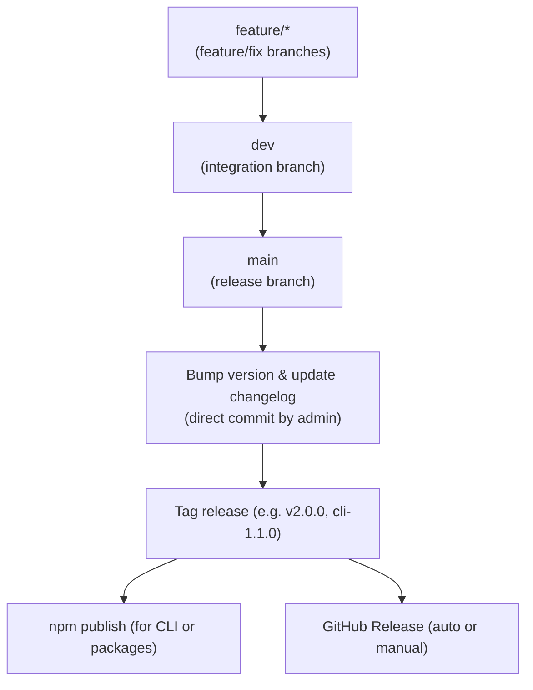

# Monorepo Release Workflow

This document describes the standard workflow for feature development, versioning, release, and branch protection in this monorepo. It follows open source best practices and is designed for clarity, traceability, and automation.

---

## Branching & Release Strategy

- **All code changes** must go through Pull Requests (PRs) and be merged into `dev`.
- **No direct commits** are allowed on `dev` (PR review required).
- **Releases** are always made from `main`.
- **Direct commits on `main` are allowed only for version bump and changelog updates during a release** (by admins/maintainers).
- **All other code changes on `main` must go through PR review.**

---

## Workflow Overview

---

## Step-by-step

1. **Feature/fix development**
   - Create a branch from `dev` (e.g. `feature/cli-refactor`).
   - Open a PR to `dev`.
   - PR must pass all status checks and be reviewed.

2. **Merge to `dev`**
   - All features/fixes are merged into `dev` via PR.
   - `dev` is the integration branch for ongoing work.

3. **Prepare a release**
   - When ready, open a PR from `dev` to `main`.
   - After review and passing checks, merge into `main`.

4. **Bump version & changelog (on `main`)**
   - On `main`, bump the version and update the changelog (e.g. in `packages/cli/package.json` and `CHANGELOG.md`).
   - Commit these changes directly to `main` (admins/maintainers only).

5. **Tag the release**
   - Create a tag (e.g. `cli-1.1.0` or `v2.0.0`) on the bump commit.
   - Push the tag to GitHub.

6. **Publish**
   - For CLI or packages: run `npm publish` from the relevant directory.
   - A GitHub Release is created automatically (via Actions) or manually, referencing the changelog.

---

## Branch Protection Summary

- **main**: PR review required for code, direct commits allowed for release bump/changelog (admins only).
- **dev**: PR review required, no direct commits.
- **No force-push or branch deletion allowed.**

---

## Example commit messages

- `cli: release 1.1.0`
- `chore(release): bump version to 2.0.0 and update changelog`

---

## Notes

- Always ensure the tag points to the commit with the correct version and changelog.
- Only admins/maintainers should perform the release bump/tag/publish steps.
- All code changes must be reviewed via PR, even for maintainers.

---

## Multi-Product Versioning & Release Structure

This monorepo manages three main release streams:

1. **CLI** (`packages/cli`)
   - Independent versioning and changelog
   - Published on npm as `create-vite-powerflow`
   - Tags: `cli-1.2.0`, `cli-1.3.0`, ...
   - Changelog: `packages/cli/CHANGELOG.md`
   - GitHub Releases: one per CLI tag

2. **Starter** (`apps/starter`)
   - Independent versioning and changelog
   - Used as the main template for generated projects
   - Tags: `starter-1.1.0`, `starter-1.2.0`, ...
   - Changelog: `apps/starter/CHANGELOG.md`
   - GitHub Releases: one per Starter tag

3. **Monorepo Global**
   - Versioning and changelog for cross-cutting changes (scripts, infra, automation, etc.)
   - Tags: `v2.0.0`, `v2.1.0`, ...
   - Changelog: `CHANGELOG.md` (root)
   - GitHub Releases: one per global tag

---

### Tag & Release Convention Table

| Component | Tag Example   | Changelog Location        | Release Description           |
| --------- | ------------- | ------------------------- | ----------------------------- |
| CLI       | cli-1.2.0     | packages/cli/CHANGELOG.md | CLI-specific changes/features |
| Starter   | starter-1.1.0 | apps/starter/CHANGELOG.md | Starter template improvements |
| Monorepo  | v2.0.0        | CHANGELOG.md (root)       | Infra/scripts/global changes  |

---

### How to Use This Structure

- **When you update the CLI** (new features, fixes, etc.):
  - Bump version in `packages/cli/package.json`
  - Update `packages/cli/CHANGELOG.md`
  - Commit, tag (`cli-x.y.z`), push, publish on npm, create GitHub release

- **When you update the Starter**:
  - Bump version in `apps/starter` (if needed)
  - Update `apps/starter/CHANGELOG.md`
  - Commit, tag (`starter-x.y.z`), push, create GitHub release

- **When you make global/infra changes**:
  - Update root `CHANGELOG.md`
  - Tag (`vX.Y.Z`), push, create GitHub release

---

### Example Combined Release History

| Tag           | Description/Changelog |
| ------------- | --------------------- |
| v2.0.0        | Monorepo global       |
| cli-1.2.0     | CLI                   |
| starter-1.1.0 | Starter               |
| v1.1.0        | Monorepo global       |
| cli-1.1.0     | CLI                   |

---

### Notes

- Each product/package has its own changelog, version, and release cycle.
- The GitHub Releases page will show a combined history for all tags.
- This structure is inspired by Vite, Turborepo, Nx, and other major open source monorepos.

---

**This ensures clarity, scalability, and professional release management for all users and contributors.**
**This workflow is inspired by the best practices of major open source monorepos (Vite, Next.js, Turborepo, etc.).**
